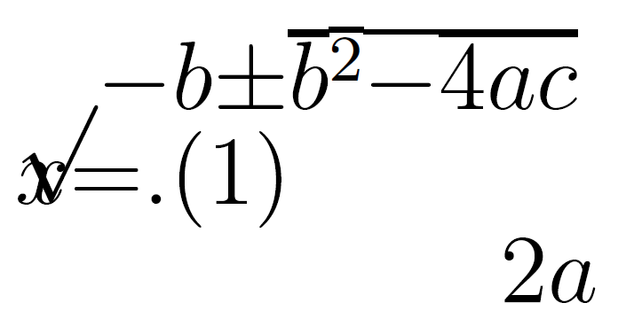

\newpage
\pagenumbering{arabic}

# Where do you start? {-}

* Why worry about maths access?
* What are the problems and solutions?
* How do you get started?

# Why worry about maths access?

Accessibility is a legal requirement... I am not a lawyer. Seek advice.

* Equal access:
  * England, Scotland, Wales: [Equality Act 2010 ](https://www.legislation.gov.uk/ukpga/2010/15/contents)
  * Northern Ireland, as amended: [Disability Discrimination Act 1995](http://www.niassembly.gov.uk/globalassets/Documents/RaISe/Publications/2012/ofmdfm/2712.pdf)
  * Ireland: [Equal Status Acts 2000 - 2018](https://www.ihrec.ie/guides-and-tools/human-rights-and-equality-in-the-provision-of-good-and-services/what-does-the-law-say/equal-status-acts/) 
* Accessible web content (considered to cover University VLE content):
  * UK: [Public Sector Bodies (Websites and Mobile Applications) (No. 2) Accessibility Regulations 2018](https://www.legislation.gov.uk/uksi/2018/852/contents/made)
  * Ireland: [European Union (Accessibility of Websites and Mobile Applications of Public Sector Bodies) Regulations 2020](https://www.irishstatutebook.ie/eli/2020/si/358/made/en/print)

## But we should care anyway...

Mathematics at university level is

* "characterised by the need for a high degree of conceptual and abstract thinking within the learning process" (Mathematics Subject Benchmark)

**We want** students to have the processing capacity to engage with concepts and abstract thinking!

Students with a print disability, with difficulties with taking notes, memory and concentration may spend substantial processing capacity on entirely different tasks.

# What are the problems?

Generally speaking we need to make it possible to access and consume information in a variety of ways. 

* All students, but especially those with e.g. Dyslexia, benefit from colourful, interactive, responsive resources with well rendered maths and graphics, enriched with video and audio. Go for it!
* But poorly made resources create practical and technical barriers:
  * Complex navigation/accurate input hard using keyboard/pointer only
  * Maths needs to be chunkable and navigable for speech, magnification, Braille and small screens
  * Use of colour-only to give meaning is a problem
  * Raster graphics do not magnify/zoom well
  * Responsive pages with multiple foci hard for VI users

## Maths in PDF is inaccessible

<iframe width="560" height="315" src="https://www.youtube-nocookie.com/embed/BsTqEjTIILQ?start=42&rel=0&end=63" frameborder="0" allow="accelerometer; autoplay; encrypted-media; gyroscope; picture-in-picture" allowfullscreen></iframe>

## Could we solve it by...?

You might ask, can we not solve this by ensuring that the PDF is accessible? Unfortunately, the answer is no. The act of creating the PDF destroys information about the structure of the mathematical expression. 

{alt="Jumbled mess of elements of the quadratic equation with the fraction structure and square root structure completely destroyed." width="60%"}

# What are the solutions?

Using assistive technology effectively for maths requires:

* Authors to produce accessible mathematical materials
* Readers to have assistive technology which works with the specific format of mathematical text

## Structure

Computers rely on structural integrity to process maths:

* PDF, print, handwriting and E-books using images of maths cannot be processed. They are inaccessible and inflexible on, for instance, small screen devices. They are lossy formats for maths!
* Word, HTML based formats and EPub3 have structural integrity for maths and are accessible to many assistive technologies
* But not all AT can access maths all formats! PowerPoint 365 is theoretically accessible but most AT won't work with it
* And most mathematicians use specialist scientific document preparation systems such as LaTeX, which, historically, have not output these formats

## Could we convert the LaTeX?

* It depends on the LaTeX...
* It is **not possible** to convert LaTeX to html in the general case 
* It is easy to 'fall out' of the convertible subset without realising or knowing why, the addition of a package, change of preamble order, use of a seemingly innocent command...

## Could we convert the mathematicians?!

Any new document preparation system needs to ***enable*** the writer by providing the key features of mathematical/scientific document preparation. And these features make things complex. 

* Software is catching up and in flux.
* Nothing is easy to learn.

Increasingly mathematicians are exploring and converting, but they need appropriate institutional infrastructure, support, workload time allocation and training. Without this the task remains unreasonable.  

## What do we convert ***to***?

Only three formats of mathematical text are accessible:

* HTML using MathJax to render the mathematics
* Word/PowerPoint using the inbuilt equation editor
* EPub3 using MathML

Whatever **other** formats you supply you **must** supply at least one or, ideally, all of these to meet the public bodies requirement. 

* Supply your course content 'spine' in this format.

## Is that enough?

No. The equal access acts mean we need to meet individual needs so you may need to produce any of the other formats. This makes PowerPoint a problem as it cannot be converted.

**And** you also need to supply PDF! 

* Not all accessibility is about technical access
* Clear print PDF is selected most often by disabled students in the Department of Mathematical Sciences.

# How do you get started?

Ideals are great but let us be pragmatic. 

* Assess where you are
* Have a plan for meeting individual needs for equal access
  * Leadership: Recognise this may be expensive for a number of years. It will get cheaper. We've been doing this for nearly 20 years. This semester one lecturer used this plan.  
* Pick something achieveable to change in your general practice 
  * Leadership: What is achievable depends on the resources you provide and this is what ultimately reduces risk and cost.
* Start!
  * Be clear about what is and is not accessible and what a student should do if they need a different format (see having a plan)

## Word/PowerPoint 365

  * Use the inbuilt Accessibility Checker and information on e.g. [Making your Word documents accessible](https://support.office.com/en-gb/article/make-your-word-documents-accessible-to-people-with-disabilities-d9bf3683-87ac-47ea-b91a-78dcacb3c66d)
  * Write *all* mathematical text written using the MS 365 equation editor. E.g. if you are writing about the variable \(x\) or \(\theta\) it should be written as an equation. If you are writing \(x^2\) it should be written as an equation.
    * Never use insert symbol.
    * Never write superscripts, subscripts, fractions etc. using font or style changes and standard keyboard input alone
    * Never use an image of an equation.
  * Use Review -> Read Aloud (Alt + Ctrl + Space) to check the maths 

More information and tools within [accessible mathematical Word document workshop resources](https://stem-enable.github.io/WordWorkshop/) and [effective (keyboard-only) input of maths in Word](https://bathmash.github.io/gettingstarted/Word/index.html). 
 
## Sounds solved to me?
 
Some students will require MathType format

* Because their AT vendor has not implemented the interface to Word but the AT does work with MathType. Test everything and contact the vendors!
* Materials should be prepared as above and then a ***copy*** converted to MathType as automatic conversion of all expressions cannot be reversed.

Also... this generally won't work for the mathematicians and some scientists.
 
* Word is not a scientific document preparation system. 
* For those who use LaTeX we need a different plan.

## Web: WCAG 2.1 AA + MathJax!

* Check it meets the legal requirement of WCAG 2.1 Level AA with e.g. [Accessibility Insights for Web plugin for Chrome](https://accessibilityinsights.io/docs/en/web/overview)

* Check it is MathJax... Right click!
\[x = \frac{-b\pm\sqrt{b^2 - 4ac}}{2a}\]

  * Provides/enables: navigation, chunking, zoom, copy/paste, colour, size and layout changes...
  * Structural integrity enables assistive technology including text-to-speech, screenreaders, electronic Braille
  * Fallback for ARIA-aware AT without native support
  * AT providers without native support and not ARIA aware are a problem but not your problem.
* [Experience this yourself](https://people.bath.ac.uk/cspehj/coventry/arclengthInR.html)

## Supporting mathematicians

* Web + MathJax is the most accessible end format for a mathematical or scientific document but we need a way to prepare the document. 
* We are not perscriptive, we'll support anything which works. 
* Two main approaches have attracted most of the mathematicians at Bath but there are some other rarer contenders! 

## Try converting the LaTeX

* Experts: [tools which may work for a large subset but cannot tell you anything about why something doesn't work](https://hub.docker.com/r/bathmash/mathaltnotes)
* Non-experts at Bath who want to stick with LaTeX have found that [lwarp](https://ctan.org/pkg/lwarp?lang=en) works for them if they are careful. 
  * Beware of some hard work (documentation currently 1237 pages)
  * What happens depends on what you are doing in LaTeX
  * You have to work that out and test for accessibility for yourself.
  * [Quick lwarp demo](https://github.com/STEM-Enable/Getting-started-with-accessible-maths-March-2023/raw/main/example/LwarpExample.zip) ([link for Emma during the talk](https://posit.cloud/content/5657619))
 
## RMarkdown formats
 
RMarkdown is a language designed for transform to html 

* LaTeX for equations 
* Simple markup language for the rest of the document. 
* Authors are confined to a transformable subset with a quick compile loop and a supportive GUI. 
* The output has known accessibility features. 
* The typesetting is still extensible, just more reasonably so.
* More information on getting started with RMarkdown see [Using R as a basis for writing an accessible mathematical document](https://stem-enable.github.io/RMarkdownWorkshop/)
* [Quick RMarkdown demo](https://github.com/STEM-Enable/RMarkdownWorkshop/raw/master/examples/arclengthInR.zip) ([link for Emma during the talk](https://posit.cloud/content/4447915))

## Bookdown/Clavertondown

Eventually, you will probably want [Bookdown](https://bookdown.org/):

\BeginKnitrBlock{theorem}
<strong>Theorem 4.1  </strong>
Bookdown is needed for things like theorems and internal references

\EndKnitrBlock{theorem}

We built [Clavertondown](https://bathmash.github.io/clavertondown/) for additional functionality important in pure mathematics and for lecturers generally. 

\BeginKnitrBlock{Thought}
<strong> Thought 4.1:  </strong>
You can create new theorem types without affecting the Bookdown types such as theorem <a href="#thm:thm1">4.1</a>.

\EndKnitrBlock{Thought}

\BeginKnitrBlock{Nugget}
<strong> Nugget 4.2:  </strong>
And you can have theorem types share numbering

\EndKnitrBlock{Nugget}

## Maths e-assessment

* [Numbas aims to meet WCAG 2.1 AA](https://docs.numbas.org.uk/en/latest/accessibility/editor.html)
* [Stack aims to meet WCAG 2.1 AA](https://stack-assessment.org/Legal/Accessibility/)
* There are probably others but these are the only ones I have used

## Simple graphs: Desmos

* [Desmos was designed to work and tested with screenreaders and written to conform to WCAG 2.1](https://www.desmos.com/accessibility)
* [Experience this yourself](https://people.bath.ac.uk/cspehj/coventry/arclengthInR.html)

<iframe src="https://www.desmos.com/calculator/rtvcqeg9ol?embed" width="700px" height="300px" style="border: 1px solid #ccc" frameborder="0">\label{sine}](./Figs/desmos-sine-graph.png){width=60% longdesc=https://www.desmos.com/calculator/rtvcqeg9ol}</iframe>

## Geogebra: but be careful!

* [Geogebra aims to meet WCAG 2.1 AA](https://www.geogebra.org/m/r2EF8uRx)
* But, just because you can make a usable accessible object with a piece of software doesn't mean every object you make is! 
* [Project **Beyond alt text** between Bath and Coventry produced guidelines](https://bathmash.github.io/CETL-MSOR-2022-Beyond-alt-text/index.html)
* It is possible and useful but you need to take time and care.

## BrailleR: for the statisticians

* [BrailleR](https://github.com/ajrgodfrey/BrailleR) is a project by and for [blind statisticians who use R](https://r-resources.massey.ac.nz/BrailleR/)

\includegraphics{./Figs/myhist2.svg.pdf}

\label{histplotinteractive}](./Figs/myhist2.svg){longdesc=./Figs/myhist2.html}

## Other diagrams

* [DIAGRAM Center](http://diagramcenter.org/) has some great resources for those new to diagram description:
  * Poet Image Description Training Tool
  * Image description guidelines
  * Sample book
  * [Webinar on complex images](http://diagramcenter.org/diagramwebinars.html#compleximages)
* [UKAAF has guidance on accessible images](https://www.ukaaf.org/standards/#accessible-images) 
* [NCAM (Old site) has guidelines and examples]( http://ncamftp.wgbh.org/ncam-old-site/experience_learn/educational_media/stemdx.html)

# What is my next step?

If you have a laptop, have a play right now!

* LaTeX available? Try [Lwarp](LINK)
* Rstudio available? Try [RMarkdown](https://stem-enable.github.io/RMarkdownWorkshop/)
* Chrome web browser available? Try [Desmos with ChromeVox](https://people.bath.ac.uk/cspehj/coventry/arclengthInR.html)
* Word user? Write some text and an equation and [listen back to it](https://stem-enable.github.io/WordWorkshop/immersive.html) 

If not, watch, exchange ideas, think, chat:

* What achieveable next step can you commit to to improve the accessiblibility of your mathematical teaching resources for next academic year?

# Further information

* This document: [Getting started with accessible maths March 2023]()
  * There are links throughout to further resources for getting started
* The core group is [JISC Accessibility Community Maths Working Group](https://github.com/A11yMaths) with mailing list [A11yMaths mailing list](https://www.jiscmail.ac.uk/cgi-bin/webadmin?A0=ACCESSIBLE-MATHS)
* [**sigma** Network Accessibility Special Interest Group](http://www.sigma-network.ac.uk/sigs/accessibility-sig/)
* A collection of links to most things I have done related to maths accessibility can be found at [Mathematics accessibility on the Skills Centre: MASH site](https://www.bath.ac.uk/projects/mathematics-accessibility/)
* My email address is [E.H.Cliffe@bath.ac.uk](mailto:E.H.Cliffe@bath.ac.uk) but please email my team [MASH](mailto:mash@bath.ac.uk), who, these days, know as much as I do!

<!--chapter:end:index.Rmd-->

